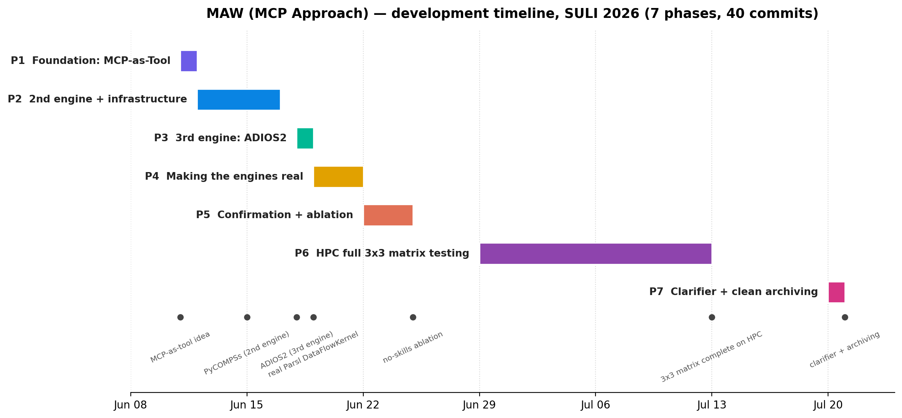

# MAW — Multi-Agent Workflow (MCP Approach)

> 🤖 **LLM agents that turn a described scientific workflow into a *running* one — installing the software, generating the code, and executing it through MCP, across three workflow engines, with zero changes to the agent code.** ⚙️🔬


A team of LLM agents that turns a natural-language description of a scientific workflow —
a published paper, a plain-language goal, or a workflow diagram — into a **running**
workflow: it identifies the tasks, installs the software, generates the code, executes the
workflow through a workflow engine, and captures the results. The workflow engine is exposed
as an **MCP (Model Context Protocol) server** that the agent calls step by step, rather than
emitting a single monolithic script.

This branch (`local_final_version`) is the final state of the SULI 2026 internship work.

---

## Table of contents
1. 🧭 [What this is](#1-what-this-is)
2. 🚀 [Quick start](#2-quick-start)
3. 🏗️ [Architecture map](#3-architecture-map)
4. ⏳ [Development timeline](#4-development-timeline) ← *read this to understand how the system got here*
5. 🧠 [Key design decisions](#5-key-design-decisions)
6. ⚠️ [Known limitations & gotchas](#6-known-limitations--gotchas)
7. 🔮 [Where to go next](#7-where-to-go-next)
8. 🗂️ [Repository map](#8-repository-map)

---

## 1. What this is

The system is a **supervisor multi-agent framework** built on LangGraph. A central
orchestrator routes work to specialized worker agents and reviews their output after each
step. The same agent layer drives three different workflow engines — **Parsl, PyCOMPSs,
ADIOS2** — selected by a single command-line flag, with no change to the agent code; only
the MCP server behind the interface is swapped.

Reproducing a published paper is the framework's most demanding *test case*, not its
objective: the system accepts any natural-language goal, with or without a paper.

---

## 2. Quick start

### Prerequisites
- Python 3.10+ and a virtual environment (the framework itself creates a per-run venv for
  workflow tasks, but you still need an environment to run the agent).
- Access to the LLM endpoint. The agent uses an OpenAI-compatible client (`ChatOpenAI`)
  pointed at the ANL Argo gateway. **This requires the ANL VPN** — without it, DNS
  resolution of the endpoint fails.
- Environment variables:
  - `MODEL_NAME` — orchestrator/agent model (default `claudeopus48`).
  - `CODER_MODEL_NAME` — explorer/code model (default `claudesonnet46`).
  - `OPENAI_API_KEY` / endpoint config for the Argo gateway.
  - `MCP_ARCHIVE_ROOT` *(optional)* — where completed runs are archived (defaults to the
    LCRC gpfs path on HPC, or `~/MCP_runs` locally).

### Install
```bash
python3 -m venv venv3 && source venv3/bin/activate
pip install -r builds/requirements.txt
```

### Run a workflow (local)
Only the **molecular nucleation** use case runs fully on a laptop; cosmology and eddy are
HPC-only (see §6).

```bash
# Description-only (combination d): no paper, just a goal
python agent_mcp.py --combination d --domain molecular_nucleation \
  --goal "Run a producer/consumer workflow that simulates crystallization with LAMMPS and visualizes it with OVITO."

# Paper-driven (combination b): PDF + short goal
python agent_mcp.py --engine parsl --combination b --paper 1 \
  --goal "Reproduce this workflow using LAMMPS and OVITO."
```

### Run on HPC (LCRC Improv/Swing)
```bash
source setup_hpc.sh          # sets LD_LIBRARY_PATH for Intel MPI
python agent_mcp.py --combination b --env hpc --engine parsl \
  --domain cosmology --paper <path> --goal "..."
```

### Where the output goes
- During a run: `work/run0/` (a single shared scratch directory — see §6).
- **After a run: each run's results are automatically organized into their own folder so
  they never get mixed up between runs.** `run_archiver.py` copies that run's outputs +
  `trace.json` into a self-describing folder named `<usecase>_<MMDD>_<HHMMSS>` under
  `MCP_ARCHIVE_ROOT` — locally this is **`~/MCP_runs/`** (on HPC, the LCRC gpfs path).
  **Look here for a finished run's figures/data**, not in the shared `work/run0/`.
- Traces: `runs/<timestamp>_trace.json`. Visualize them with `demo_workflow.ipynb`.

### CLI reference
| flag | values | meaning |
|------|--------|---------|
| `--combination` | `a` \| `b` \| `c` \| `d` | input mode: `a`=PDF+Image+Desc, `b`=PDF+Desc, `c`=Image+Desc, `d`=Desc only (**required**) |
| `--engine` | `parsl` \| `pycompss` \| `adios` | workflow engine (default `parsl`) |
| `--env` | `local` \| `hpc` | execution environment (default `local`) |
| `--condition` | `A` \| `B` \| `C` | ablation: A=no-skills, B=full (default), C=single-agent |
| `--domain` | free text | use-case label, e.g. `molecular_nucleation`, `cosmology`, `eddy_uv` |
| `--paper` / `--image` | path or index | paper PDF / diagram image |
| `--goal` | text | the natural-language goal |
| `--trial` | int | trial number for repeated runs |

---

## 3. Architecture map

```
                 ┌──────────────┐
   START ───────►│ Orchestrator │◄──────── returns after every worker
                 │ (supervisor) │
                 └──────┬───────┘
        conditional edge │  routes to exactly one worker, then END
      ┌──────────┬───────┼──────────┬───────────┐
      ▼          ▼       ▼          ▼           ▼
 Clarifier    Planner  Installer  Explorer     END
 (optional)                          │
                                     ▼ MCP tools (submit_task, get_task_result, …)
                        ┌────────────┴────────────┐
                   parsl_server / pycompss_server / adios_server   (swap via --engine)
                                     │
                                     ▼
                        local virtual environment
                   (LAMMPS, OVITO, Parsl, ADIOS2, NumPy, …)
```

**Agents** (all in `agent_mcp.py`):
- **Orchestrator** — supervisor/router; reviews output, decides the next step, caps revisions.
- **Clarifier** *(optional, `clarifier.py`)* — on the first routing decision, checks how many
  of six spec slots the user's request covers and asks only the missing ones. Deterministic
  trigger; runs at most once.
- **Planner** — interprets the input into literature findings, a dependency stack, and an
  ordered task plan.
- **Installer** — two-phase venv setup: write `requirements.txt` → orchestrator approval →
  `pip install`.
- **Explorer** — ReAct loop: generate code → call MCP tool → observe → retry. Owns the MCP
  session to the engine.

**Engines** (`servers/*.py`) — each an MCP server exposing the same tool primitives
(`submit_task`, `get_task_status`, `get_task_result`, `get_resources`, `list_files`, …):
- `parsl_server.py` — real Parsl `DataFlowKernel` (`@python_app`, `HighThroughputExecutor`).
- `pycompss_server.py` — PyCOMPSs `@task` + runtime lifecycle.
- `adios_server.py` — ADIOS2 BP-file I/O; task execution via subprocess.

**Skills** (`skills/`) — Markdown files injected into agent prompts; behavior comes from
here, not hard-coded logic:
- `agents/` — per-agent role instructions.
- `systems/` — per-engine API/config knowledge (parsl, pycompss, adios).
- `knowledge/` — environment knowledge (`local`, `lcrc`).
- `use_cases/` — per-problem domain knowledge (`molecular_nucleation`, `cosmology`, `eddy_uv`).

**Traceability** — `trace_logger.py` + `trace_schema.py` emit a schema-validated
`trace.json` per run (agents, routing, tool calls, skill loads, token usage). This is the
interface the evaluation consumes.

---

## 4. Development timeline

The project evolved in seven phases (Jun 11 – Jul 21, 2026). Reading this in order shows
*why* the system is shaped the way it is.



<sub>*Regenerate after new work with `python docs/make_timeline.py` (edit the `PHASES` /
`MILES` lists in that script to add a phase).*</sub>

### Phase 1 — Foundation: MCP-as-Tool (Jun 11)
The core idea landed first: expose the workflow engine as an MCP server the agent calls
interactively, instead of generating a standalone script. Auto use-case matching and
local/venv execution followed the same day. A **scientific-integrity rule set** was added
early ("no fake data, no simulated benchmarks") — a value that shaped every later evaluation.

### Phase 2 — Second engine + infrastructure (Jun 12–17)
PyCOMPSs was added as a second backend, proving the engine-swap idea. Local and HPC runtimes
were separated, the `get_resources` MCP tool and MPI support were added, and LAMMPS+MPI
install issues were fixed. The **trace logger and demo notebook** were built here — the
observability layer that later became the evaluation interface. An installer infinite-loop
bug and token-usage reporting were addressed.

### Phase 3 — Third engine: ADIOS2 (Jun 18)
ADIOS2 was added as a third MCP server, extending the framework beyond schedulers to an
I/O/streaming backend.

### Phase 4 — Making the engines real (Jun 19–22)
Turning point. Until now the engines were partly *nominal*. Parsl task execution was routed
through a **real `DataFlowKernel`** (`@python_app`, `HighThroughputExecutor`), with the
executor sized to the PBS allocation on HPC. A LangSmith-style **waterfall** trace view was
added. Docker/containerization was **removed** in favor of a pure per-run venv flow — a
deliberate simplification.

### Phase 5 — Confirmation + ablation (Jun 22–25)
PyCOMPSs and ADIOS2 runs were confirmed end to end. Script-level tracing was added. The
**condition-A (no-skills) ablation toggle** was introduced — the basis for the later finding
that structured context is what prevents hallucination.

### Phase 6 — HPC full-matrix testing (Jun 29 – Jul 13)
Runs were organized and archived by (use case × engine × condition × combination). The agent
learned to generate its own PBS script (simulation + visualization in one job). All three
engines were hardened, and the **full 3×3 use-case × engine matrix** was tested on the LCRC
Improv cluster (all combinations completed). See `TEST_RUNS/mcp_approach/` for the traces.

### Phase 7 — Human-in-the-loop + clean archiving (Jul 21)
The **clarifier** was redesigned from a hard-coded pre-processing step into an *optional
graph node* the orchestrator routes to when a request is underspecified, asking only the
missing slots. A **deterministic slot-coverage gate** was added because the orchestrator, left
to its own judgment, always inferred the gaps and never triggered the clarifier. Per-run
output **archiving** was added so each run lands in its own self-describing folder. Details:
`README_clarifier_archive.md` and `CHANGELOG.md`.

---

## 5. Key design decisions

- **Workflow-as-tool (MCP), not code generation.** The engine sits behind an MCP tool
  interface the agent calls step by step. This gives interactive recovery (fix one failing
  step, not the whole script), step-wise validation, failure isolation, and engine
  swappability. The abandoned "artifact approach" (generate one big script) is described in
  `PROJECT_CONTEXT.md` as design rationale.
- **Engine-agnostic agent layer.** The explorer calls the same tools regardless of engine;
  `--engine` swaps the MCP server. Adding a backend = one new MCP server + one skill file.
- **Skill-driven behavior.** Per-agent, per-engine, and per-environment behavior lives in
  `skills/*.SKILL.md`, not in agent code. Moving from laptop to HPC is a skill edit.
- **Structured context prevents hallucination.** The condition-A ablation showed that without
  skill context, agents fabricate configs, report false success, or bypass the engine with ad
  hoc subprocess calls.
- **Clarifier trigger is deterministic, not LLM-judged.** A mechanical slot-coverage check
  decides whether to clarify; the LLM only decides whether a given slot is mentioned.
- **Everything is traced.** `trace.json` is schema-validated and is the single interface
  between this framework and the evaluation.

---

## 6. Known limitations & gotchas

- **ANL VPN required.** The Argo LLM endpoint (`*.inside.anl.gov`) is unreachable without the
  VPN; symptom is a DNS `nodename nor servname` error.
- **`streaming=True` is mandatory.** The Argo endpoint returns `500 - Streaming is required…`
  for long calls. All `ChatOpenAI` clients set `streaming=True`; do not remove it.
- **HPC-only use cases.** Only molecular nucleation runs fully on a laptop. Cosmology (HACC)
  and eddy (Nek5000) require an LCRC PBS allocation; the explorer's `get_resources` guard
  stops a run that isn't inside a PBS job. Run them with `--env hpc` after `source setup_hpc.sh`.
- **`work/run0/` is a single shared scratch directory.** Every run writes there and can
  overwrite the previous run's files. It is hard-coded (`DEFAULT_WORK_DIR` in the servers, and
  `/app/work/run0` in skill text), so it is intentionally left alone. Isolation happens at
  archive time (`run_archiver.py`, mtime-filtered), not by changing the working directory.
- **Parsl calls block.** Each Parsl tool call currently blocks on `.result()`; there is no
  cross-task DAG parallelism yet (see §7).
- **Archive folder naming omits the engine.** Folders are `<usecase>_<MMDD>_<HHMMSS>`; the
  engine is only in each trace's `framework` field.

---

## 7. Where to go next

- **More engines** — add backends beyond Parsl/PyCOMPSs/ADIOS2 (one MCP server + one skill).
- **More use cases** — broaden beyond the three domains and beyond paper reproduction.
- **Async, cross-task DAG execution** — remove the per-call `.result()` blocking for true
  task-level parallelism.
- **Stronger automated output validation** — e.g. compile-check generated scripts before
  submission; programmatic checks against reference outputs (currently manual, per use case).
- **Machine-readable software metadata** — so the installer can query package
  install-methods/dependencies instead of relying on hand-authored environment rules.
- **ACADEMY framework integration** — evaluate portability of the multi-agent design across
  HPC infrastructures.

---

## 8. Repository map

| Path | What it is |
|------|-----------|
| `agent_mcp.py` | Main entry point: agent definitions, LangGraph graph, `__main__` runner. |
| `clarifier.py` | The optional clarifier module (ask-only-missing, 6 slots, provenance). |
| `mcp_explorer.py` | Explorer's MCP client / ReAct execution loop. |
| `servers/parsl_server.py` | Parsl MCP server (real DataFlowKernel). |
| `servers/pycompss_server.py` | PyCOMPSs MCP server. |
| `servers/adios_server.py` | ADIOS2 MCP server (BP I/O + subprocess execution). |
| `skills/` | Prompt-injected skill files (agents / systems / knowledge / use_cases). |
| `trace_logger.py`, `trace_schema.py` | Structured `trace.json` logging + schema. |
| `run_archiver.py` | Per-run output archiving into `MCP_ARCHIVE_ROOT`. |
| `demo_workflow.ipynb` | Trace visualizations (timeline, routing, waterfall). |
| `setup_hpc.sh` | `source` before HPC runs (Intel MPI `LD_LIBRARY_PATH`). |
| `builds/requirements.txt` | Agent-side Python dependencies. |
| `TEST_RUNS/mcp_approach/` | Archived HPC traces for the 3×3 evaluation matrix. |
| `PROJECT_CONTEXT.md` | Project vision + artifact-vs-MCP rationale. |
| `README_clarifier_archive.md`, `CHANGELOG.md` | Details of the final (clarifier + archive) phase. |
| `mcp_tools.py` | Currently unused; retained (see its header for rationale). |

---

*👋 Handoff note: start with §4 (timeline) to understand the "why", then §2 to run it, then
§6 before debugging anything. The most load-bearing files are `agent_mcp.py` (the graph) and
`servers/*.py` (the engines). Good luck, and have fun! 🚀🔬🎉*
